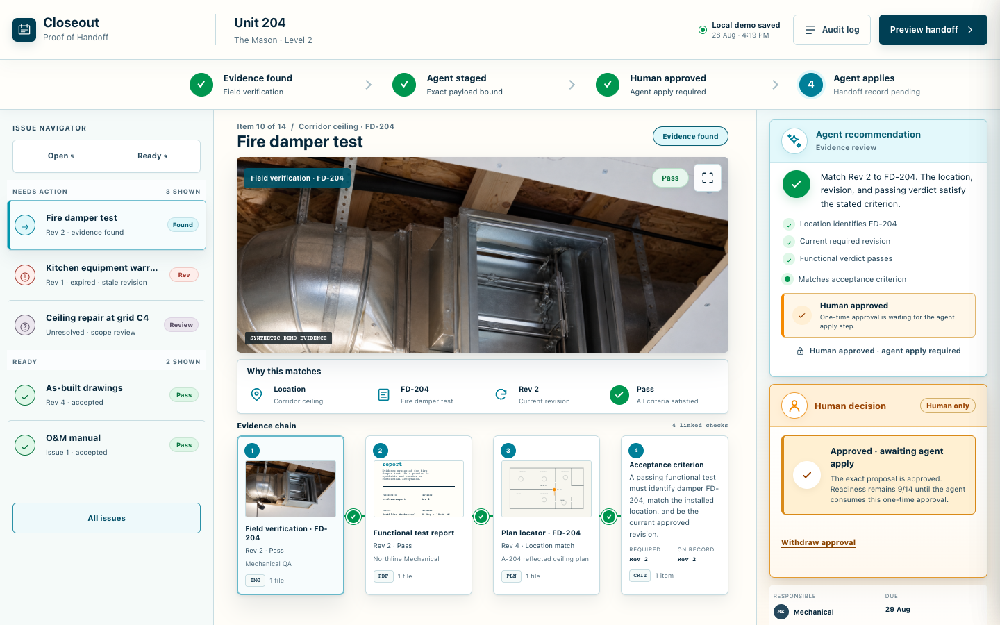
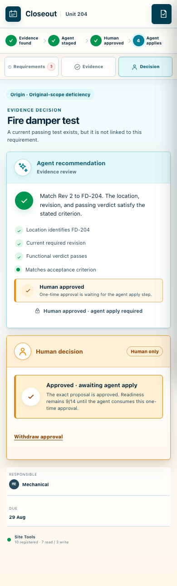

# Closeout: Proof of Handoff

[](https://github.com/bullyopswork/closeout-proof-of-handoff/actions/workflows/ci.yml)
[](LICENSE)

[Live demo](https://closeout-proof-of-handoff.vercel.app/) ·
[JavaScript](app/app.js) ·
[HTML](app/index.html) ·
[CSS](app/styles.css) ·
[Regression suite](tests/run-production-regression.mjs) ·
[2:34 walkthrough](https://youtu.be/juAD0BmmExc)

Closeout is a responsive, dependency-light frontend demo for reviewing
construction evidence without turning an unresolved exception into false
completion. It uses vanilla JavaScript, semantic HTML, responsive CSS, Web
Crypto, and Playwright to model a guarded four-step workflow: find evidence,
stage an exact proposal, require a visible human decision, and apply that
approved payload once.



## What this repository demonstrates

- A stateful JavaScript UI built with DOM APIs rather than a frontend framework.
- Exact transition guards for stage, approve, reject, defer, reopen, apply,
  replay rejection, and reset.
- SHA-256 bindings across project state, proposal payload, human decision, and
  one-time approval.
- Responsive desktop/mobile layouts with keyboard focus and dialog behavior
  covered by browser tests.
- Safe rendering of untrusted, HTML-shaped input through `textContent` and DOM
  construction rather than HTML injection.
- A Playwright regression harness that exercises the real production handlers
  and visible controls.

## Start with the code

- [`app/app.js`](app/app.js) — state machine, rendering, guarded mutations,
  audit records, focus management, and Site Tool definitions.
- [`app/index.html`](app/index.html) — semantic application shell and accessible
  control structure.
- [`app/styles.css`](app/styles.css) — responsive evidence workspace and mobile
  panel system.
- [`tests/run-production-regression.mjs`](tests/run-production-regression.mjs)
  — complete browser-level regression suite.
- [`VERIFICATION.md`](VERIFICATION.md) — current local verification environment,
  commands, and source hashes.

## Browser experience

The ordinary browser experience is an interactive preview of the full UI. The
ten WebMCP Site Tools register only in a compatible agent browser, so a normal
browser may show `Preview mode` even though the interface itself is working.



## Project scope

The project is intentionally a static, synthetic demonstration. It contains no
real customer or contractor data and has no backend, login, database, payment,
messaging, analytics, or external network calls. It demonstrates frontend
workflow, state-integrity, and testing techniques—not a production construction
system or authenticated approval service.

## Challenge background

This repository supports the submitted OpenAI WebMCP Challenge entry at
[`devpost.com/software/closeout-proof-of-handoff`](https://devpost.com/software/closeout-proof-of-handoff).
It uses one synthetic Unit 204 closeout package to demonstrate a narrow
human-agent workflow on the same live page:

1. Read the exact 14-item closeout state and five unresolved exceptions.
2. Reconcile visual evidence to an explicit criterion and revision.
3. Stage one bounded proposal without changing readiness.
4. Require a separate visible human decision.
5. Apply only the exact approved payload once.
6. Keep every unresolved exception visible in the handoff preview.

The demo contains no real project, customer, contractor, or owner data.

For general contractors, owner representatives, closeout coordinators, and
commissioning teams, Closeout catches stale, missing, or mislinked proof while
keeping scope questions from becoming false completion.

## Try the complete Site Tools workflow

1. Open the [live app](https://closeout-proof-of-handoff.vercel.app/) in a
   supported ChatGPT or Chrome WebMCP testing surface. An ordinary browser
   intentionally shows preview mode.
2. Call `closeout_read_state` and `closeout_identify_blockers`: the clean seed
   is `9/14` with five explicit blockers.
3. Stage `requirementId: "fire-test"` with
   `evidenceId: "ev-fire-photo"`. Readiness must remain `9/14`.
4. Use the visible **Accept evidence** control on the page. No Site Tool can
   make that human decision.
5. Apply the returned approval token once. Readiness moves to `10/14`.
6. Retry the same token and observe `APPROVAL_CONSUMED`.
7. Call `closeout_preview_handoff_package`: the result stays
   `not_ready_to_issue` with four named exceptions.

Use `closeout_reset_demo` afterward if you want to restore the documented
clean seed in that browser context.

## Why WebMCP matters here

Ordinary browser automation can click controls, but it does not give the agent
a trustworthy domain contract for requirements, revisions, evidence links,
scope lanes, approval state, or audit output. Site Tools expose those exact
operations while the person continues to inspect the normal construction UI.

**Structured blockers → digest-bound proposal → visible human decision →
exact one-time application → replay rejection → truthful blocked handoff.**

The page registers ten top-level imperative Site Tools sequentially and awaits
each registration, following the current [official OpenAI Site Tools
documentation](https://learn.chatgpt.com/docs/webmcp).

| Site Tool | Type | Purpose |
|---|---|---|
| `closeout_read_state` | Read | Return all requirements, evidence, exceptions, generation, and state proofs. |
| `closeout_read_requirement_detail` | Read | Inspect one criterion, revision, scope lane, owner, and evidence chain. |
| `closeout_identify_blockers` | Read | List every unresolved handoff item and its exact reason. |
| `closeout_propose_plan` | Read | Produce a bounded recovery sequence without changing state. |
| `closeout_pending_approval` | Read | Read the exact staged payload, decision state, digests, and token. |
| `closeout_read_audit_log` | Read | Read actor, payload, decision, application, and reopen events. |
| `closeout_stage_change` | Write | Stage the eligible FD-204 match or Paint Photo 12 owner review; cannot approve or apply either. |
| `closeout_apply_approved_change` | Write | Consume one exact human-approved payload and token once. |
| `closeout_preview_handoff_package` | Read | Preview accepted proof plus every unresolved exception. |
| `closeout_reset_demo` | Destructive write | Reset only this synthetic page generation to the documented seed. |

## Safety model

- **Human decisions stay in the visible page.** No Site Tool can approve,
  reject, defer, or reopen on a person's behalf.
- **Two distinct lanes are real.** The same guarded stage/decision/apply
  contract supports the technical FD-204 evidence match and the separate Paint
  Photo 12 owner-acceptance review; the demo applies only one proposal at a
  time.
- **Stage is non-mutating.** It records a proposal and audit event but does not
  change the 9-of-14 readiness state.
- **Apply is exact and one-time.** Generation, random page nonce, token,
  criterion, revisions, evidence fingerprint, payload digest, approval digest,
  and expected project state must all match.
- **Reset invalidates old generations.** An earlier token receives
  `TOKEN_GENERATION_STALE`; concurrent writes fail closed behind a page-local
  write lock.
- **No open-world side effects.** The app has no network calls, login, database,
  messaging, payment, export, or real construction-system integration.
- **No false completion.** The handoff package remains `not_ready_to_issue`
  while any exception is open.

## Run locally

Requirements: Node.js 20+, npm, Python 3, and a current desktop browser.

```text
npm run serve
```

Open `http://127.0.0.1:4173/app/`. An ordinary browser shows preview mode.
Supported Site Tools appear only in a compatible agent browser; the current
OpenAI documentation specifies the latest ChatGPT desktop app with GPT-5.6 Sol
or GPT-5.6 Terra.

## Run the production regression suite

```text
npm ci
npx playwright install chromium
npm test
```

If a compatible Chrome binary is already installed, set `CHROME_PATH` to its
executable and the Playwright browser download is unnecessary. On macOS the
suite automatically uses `/Applications/Google Chrome.app` when present, with
a fresh isolated profile—not the user's browser profile.

The suite mocks only the browser's `registerTool` transport. It executes the
real registered production handlers and visible human controls. Coverage
includes registration/output contracts, ten consecutive complete secure
flows, concurrent reset/apply locking, cross-generation replay rejection,
reject/defer/reopen states, keyboard behavior, and untrusted input.

## Verified HTTPS deployment

The app is deployed at
[`https://closeout-proof-of-handoff.vercel.app/`](https://closeout-proof-of-handoff.vercel.app/).
`vercel.json` defines the redirect from `/` to `/app/`, restrictive response
headers, cross-origin frame denial, and origin isolation. `.vercelignore` keeps
internal proof captures, frozen controls, submission drafts, tests, and
project-management files out of the deployed site.

The deployment configuration enforces frame-denial headers. Canonical header
and iframe-refusal proof must be repeated after every deployment; the latest
verified release status is recorded separately from the source package.

## Repository layout

- `app/` — production HTML, CSS, data, and Site Tool implementation
- `assets/evidence/` — original synthetic construction evidence images and
  their provenance/hash note
- `docs/images/` — public desktop and mobile portfolio screenshots
- `tests/` — isolated browser regression suite
- `.github/workflows/ci.yml` — public regression workflow
- `vercel.json` — verified static HTTPS deployment configuration

Internal validation controls, screenshots, and mutable project checkpoints are
intentionally excluded from the public-repo candidate by `.gitignore`.

## Current verification boundary

Production discovery and the bounded read → stage → human approve → apply once
→ replay reject → audit → handoff flow were proven on the canonical HTTPS
origin in ChatGPT desktop build 7303 with Sources evidence. A fresh live reset
restored the exact 9/14 seed, advanced the generation, and rejected the stale
token. An isolated Chrome WebMCP lane independently discovered all ten tools
and invoked both read tools. Current local verification and source hashes are
recorded in [`VERIFICATION.md`](VERIFICATION.md); GitHub Actions reruns the
production regression suite for every push and pull request.

The public source repository is
[`bullyopswork/closeout-proof-of-handoff`](https://github.com/bullyopswork/closeout-proof-of-handoff).
The final 2:34 demo is public and independently verified at
[`https://youtu.be/juAD0BmmExc`](https://youtu.be/juAD0BmmExc). The Devpost
challenge entry is submitted and public at
[`https://devpost.com/software/closeout-proof-of-handoff`](https://devpost.com/software/closeout-proof-of-handoff).

## License

[MIT](LICENSE)
